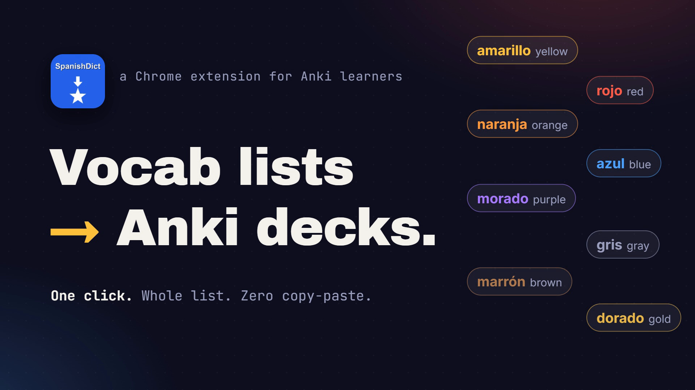
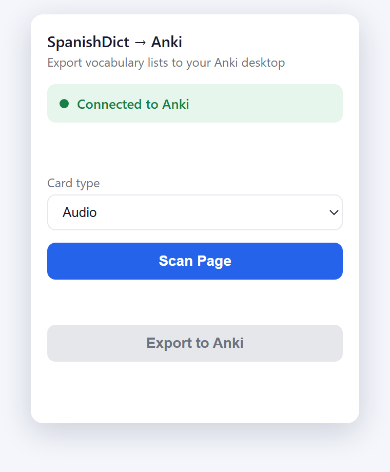
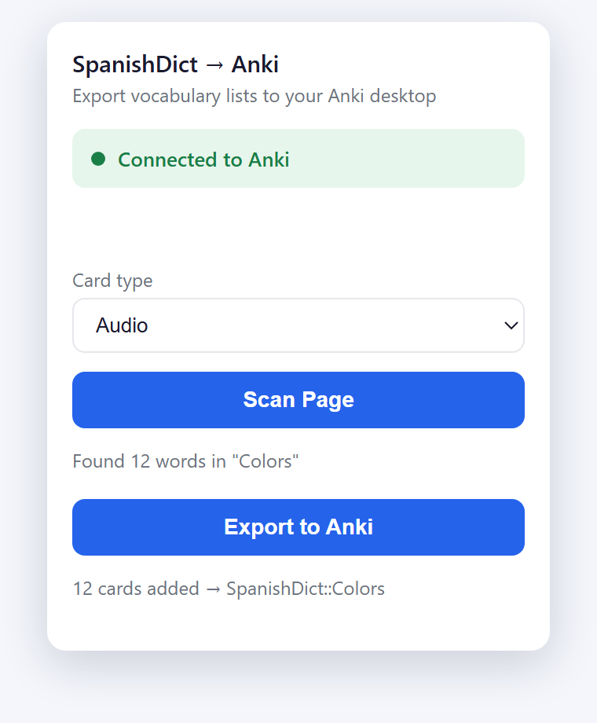
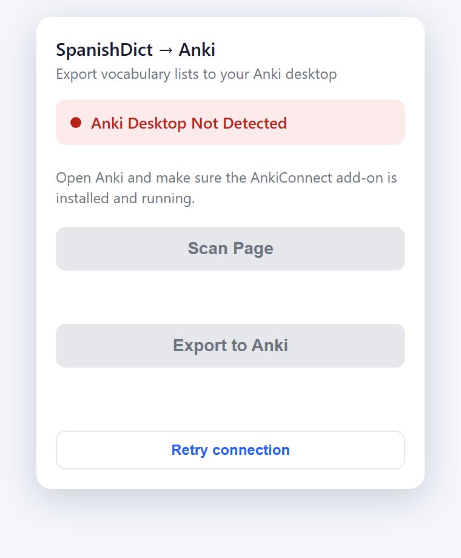
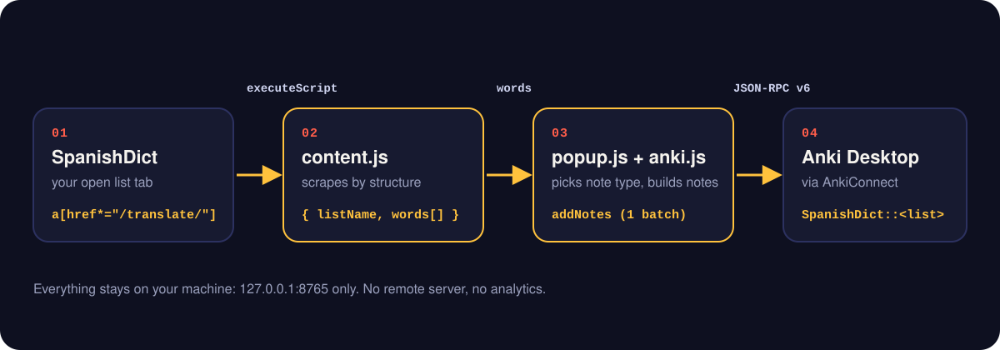
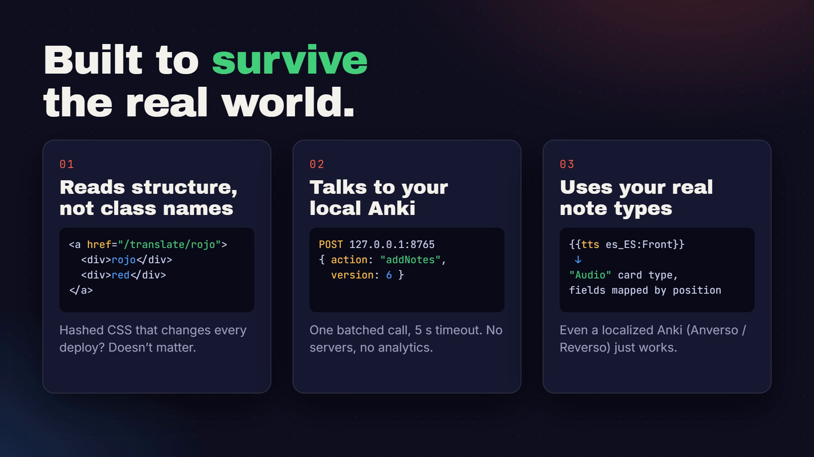
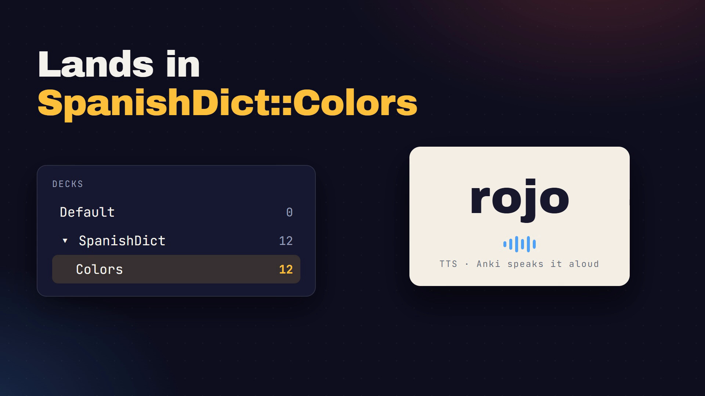

<div align="center">



<br />

# SpanishDict &rarr; Anki

**Export a whole SpanishDict vocabulary list into Anki in one click.**<br />
No copy-paste. No CSV round-trips. No account, no server.

<br />


[Demo](#-demo) &nbsp;&middot;&nbsp; [Install](#-install) &nbsp;&middot;&nbsp; [Setup](#-connect-it-to-anki) &nbsp;&middot;&nbsp; [Usage](#-usage) &nbsp;&middot;&nbsp; [How it works](#-how-it-works) &nbsp;&middot;&nbsp; [FAQ](#-troubleshooting)

</div>

---

## 🎬 Demo

<div align="center">

<a href="docs/demo.mp4">
  
</a>

<sub>33-second walkthrough &nbsp;&middot;&nbsp; <a href="docs/demo.mp4"><b>watch the full-quality MP4</b></a> &nbsp;&middot;&nbsp; a designed animation using the extension's real popup styling and a sample list (<i>Colors</i>)</sub>

</div>

---

## ✨ Why you'll like it

| | |
|---|---|
| ⚡ **One-click export** | Open any SpanishDict list, hit **Scan Page**, hit **Export to Anki**. Done. |
| 🗂️ **Auto-named decks** | Every list gets its own subdeck: `SpanishDict::<list name>`. |
| 🔊 **Audio cards** | Detects your text-to-speech note type and uses it, so Anki reads each word aloud. No audio files needed. |
| 🔁 **Four card types** | Audio, Basic (ES → EN), Reversed (EN → ES), or Basic &amp; reversed. Your choice is remembered. |
| 🛡️ **Survives site redesigns** | Reads the page *structurally*, not by hashed CSS class names that change on every deploy. |
| 🌍 **Works with non-English Anki** | Note-type fields are mapped by position, so localized names like `Anverso` / `Reverso` just work. |
| 🟢 **Knows when it's useful** | The toolbar badge shows **SCAN** only while you're on a list page. |
| 🔒 **Private by design** | Talks only to your own Anki on `127.0.0.1`. No remote server, no analytics. |

---

## 🖼️ Screenshots

<div align="center">

| 1. Connect | 2. Scan | 3. Export |
|:---:|:---:|:---:|
|  |  |  |
| Detects Anki and your note types | Reports the word count and target deck | Adds everything in a single batch |

<br />



<sub>If Anki isn't running, you get a clear message and a <b>Retry connection</b> button instead of a silent failure.</sub>

<br /><br />

<sub>Screenshots are the real popup UI, rendered with sample data.</sub>

</div>

---

## 📦 Install

> Not on the Chrome Web Store yet. Load it as an unpacked extension, which takes under a minute.

1. **Download or clone** this repository.
   ```bash
   git clone https://github.com/radhepa/SpanishDictToAnki.git
   ```
2. Open **`chrome://extensions`** in Chrome (or any Chromium browser: Edge, Brave, Arc…).
3. Switch **Developer mode** on (top-right).
4. Click **Load unpacked** and select the project folder (the one containing `manifest.json`).
5. **Pin** the extension from the puzzle-piece menu so the icon is always handy.

---

## 🔌 Connect it to Anki

The extension talks to Anki through the free **AnkiConnect** add-on. You only do this once.

**1. Install AnkiConnect.** In Anki: **Tools → Add-ons → Get Add-ons…**, enter code **`2055492159`**, then restart Anki.

**2. Allow the extension to connect (CORS).** Anki only answers origins it trusts.
Go to **Tools → Add-ons → AnkiConnect → Config** and add your extension's origin to `webCorsOriginList`:

```json
{
  "webCorsOriginList": [
    "http://localhost",
    "chrome-extension://<YOUR_EXTENSION_ID>"
  ]
}
```

> 💡 Find `<YOUR_EXTENSION_ID>` on the extension's card at `chrome://extensions`.
> For quick local testing you can use `"*"`, but a specific origin is safer.

**3. Restart Anki** and keep it running while you export.

---

## 🚀 Usage

1. 🔎 **Open a vocabulary list** on SpanishDict (`https://www.spanishdict.com/lists/...`). The toolbar badge turns green: **SCAN**.
2. 🧩 **Click the extension icon.** The popup confirms **Connected to Anki**.
3. 🎴 **Pick a card type** from the dropdown.
4. 📡 **Click Scan Page.** It reports something like `Found 12 words in "Colors"` and shows the destination deck.
5. 📥 **Click Export to Anki.** Cards land in `SpanishDict::Colors`.

---

## 🎴 Card types

| Option | Backed by | What you get |
|---|---|---|
| **Audio** | the note type whose template uses `{{tts}}` | Anki reads the term aloud, no audio files needed |
| **Basic** | `Basic` (or your first front/back note type) | Spanish → English, one card |
| **Reversed** | same note type, fields swapped | English → Spanish, one card |
| **Basic & reversed** | a note type with two card templates | both directions |

Options only appear when your collection has a matching note type, so you never see a broken choice.

> Cloze, Image Occlusion, and "optional reversed" types are intentionally excluded. The extension exports **text only**, so it can't fill cloze markup, image fields, or audio-file fields.

---

## 🧠 How it works

<div align="center">
  
</div>

The interesting engineering lives in three places.

### 1&nbsp;&nbsp;Scraping a class-obfuscated single-page app

SpanishDict is a React SPA whose CSS class names are hashed and change on every deploy (`R48g_E0W`, `v_38_Xaa`, …), so selecting by class is hopeless. The scraper keys off the one stable signal: each vocabulary row is an anchor like

```html
<a href="/translate/rojo"><div>rojo</div><div>red</div></a>
```

It collects `a[href*="/translate/"]` and reads the two column `<div>`s **by position**, never by class name. Because the content hydrates client-side, the scraper is `async` and retries for a few cycles until rows appear, gated to real list frames so empty child frames add no delay. A generic class / `lang` / audio heuristic remains as a fallback if the markup ever shifts.



### 2&nbsp;&nbsp;Talking to Anki (AnkiConnect)

All Anki communication is funneled through one wrapper, [`anki.js`](anki.js), which speaks AnkiConnect's JSON-RPC v6 envelope and guards every call with a **5-second `AbortController` timeout**, so a frozen Anki never hangs the UI. Export creates the deck if needed (`createDeck`), then batches everything into a single `addNotes` call.

```js
// anki.js: one wrapper for every AnkiConnect call
await ankiInvoke("addNotes", { notes });   // POST http://127.0.0.1:8765  { action, version: 6, params }
```

### 3&nbsp;&nbsp;Choosing the right note type

On connect, the extension reads your note types (`modelNames`), their fields (`modelFieldNames`) and their templates (`modelTemplates`), then resolves the card-type menu to your real models. It even auto-detects which one speaks aloud by scanning templates for Anki's TTS tag (`{{tts …}}`). Each word is mapped onto the chosen note type's first two fields (front / back), with an optional swap for the reversed direction.

Duplicates are kept intact: notes are added with `allowDuplicate`, so a re-export imports the full set without altering any text.

<div align="center">
  
</div>

---

## 🔐 Permissions

| Permission | Why it's needed |
|---|---|
| `activeTab` + `scripting` | run the scan on the page when you click the icon |
| `host_permissions: https://www.spanishdict.com/*` | read the open vocabulary list and drive the **SCAN** badge |
| `host_permissions: http://127.0.0.1:8765/*` | talk to your local AnkiConnect |

Nothing is sent anywhere except your own local Anki. **There is no remote server and no analytics.**

---

## 🗺️ Project structure

```text
spanishdict-anki-exporter/
├── manifest.json     # MV3 config, permissions, icons
├── background.js     # service worker: SCAN badge on list pages
├── popup.html        # popup UI + styles
├── popup.js          # UI state, scan + export orchestration, card-type menu
├── content.js        # the scraper (injected on demand)
├── anki.js           # AnkiConnect wrapper (invoke, decks, models, export)
├── icon16/32/48/128.png
└── docs/             # README images, demo GIF + video
```

---

## 🧰 Tech stack

- **JavaScript**: vanilla ES modules, no framework, no build step (Chrome Manifest V3)
- **HTML / CSS**: the popup UI
- **AnkiConnect**: local HTTP API to the Anki desktop app

---

## 🩺 Troubleshooting

<details>
<summary><b>The popup says "Anki Desktop Not Detected"</b></summary>

One of three things: Anki isn't running, the AnkiConnect add-on isn't installed, or your extension's origin isn't in `webCorsOriginList`. Fix whichever applies (see [Connect it to Anki](#-connect-it-to-anki)) and click **Retry connection**.
</details>

<details>
<summary><b>"No words found on this page"</b></summary>

Make sure you're on a list page (`spanishdict.com/lists/...`) and that the words have finished loading, then scan again. The toolbar badge shows **SCAN** only on list pages.
</details>

<details>
<summary><b>The Audio option is missing</b></summary>

Audio cards need a note type whose template uses Anki's `{{tts …}}` tag. Create or import one, reopen the popup, and the option appears automatically.
</details>

<details>
<summary><b>Will it break if SpanishDict redesigns?</b></summary>

The scraper reads page structure instead of CSS classes, so routine redeploys are fine. A large redesign could still need a selector update; the generic fallback is there to soften that.
</details>

---

## ⚠️ Limitations

- **Text only.** The scraper captures the Spanish term and English translation, not images or audio files. Audio cards work only if the chosen note type generates speech via Anki's TTS template.
- **AnkiConnect must be running** and CORS-configured (see [setup](#-connect-it-to-anki)).
- Not affiliated with SpanishDict or Anki.

---

## 📄 License

MIT. See `LICENSE`.

<div align="center">
<br />
<sub>Made for learners who would rather study words than copy them.</sub>
</div>
